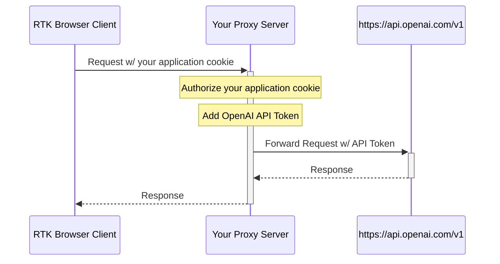

# @elkwood/openai-rtk-client

A Typed API Client with React Hooks for Redux Toolkit to communicate with the [OpenAI API](https://platform.openai.com/docs/overview)

This package offers a powerful solution for building robust API interactions within your React applications leveraging Redux Toolkit. It combines the strengths of @reduxjs/toolkit and code generation from the OpenAI API's OpenAPI schema (https://github.com/openai/openai-openapi/blob/master/openapi.yaml) to empower you to build scalable React applications with a tight coupling to OpenAI's api schema. 


## Quick Start

This guide will walk you through setting up a Redux Toolkit (RTK) client for making requests to OpenAI's API, utilizing a proxy server for secure authorization and API token management. This approach keeps sensitive information such as your API token hidden from the client-side, ensuring a secure way to interact with OpenAI's services.
Why Use a Proxy Server?

A proxy server acts as an intermediary between your client application and external services like OpenAI's API. It's crucial for scenarios where you need to append authentication headers or keep API tokens secret, which shouldn't be exposed in client-side code. The proxy handles requests from your application, enriches them with the necessary credentials, and forwards them to the intended API.
Communication Flow Diagram

> Pro tip - Try out [BricksLLM](https://github.com/bricks-cloud/BricksLLM)


Here’s a visual representation of how the RTK browser client, your proxy server, and OpenAI's API interact with each other:



Implementation Steps
1. Setting Up the Proxy Server

Before integrating the RTK client, ensure you have a proxy server configured to handle requests from your application. This server should:

  * Receive API requests from your RTK client.
  * Authenticate using your application's cookie or another authentication method.
  * Inject the necessary OpenAI API token into the request.
  * Forward the request to OpenAI's API.
  * Relay OpenAI's response back to the RTK client.

2. Integrating the RTK Client

Firstly, ensure you've installed [Redux Toolkit](https://www.npmjs.com/package/@reduxjs/toolkit) and the @elkwood/openai-rtk-client package in your project. Then, follow these steps to set up the RTK store and dispatch initial configuration actions:
```typescript

// Import necessary functions and components from reduxjs/toolkit and your OpenAI RTK Query API slice
import { Provider } from 'react-redux';
import { configureStore } from '@reduxjs/toolkit';
import { setupListeners } from '@reduxjs/toolkit/query';
import { ApiProvider, apiSlice } from '@elkwood/openai-rtk-client';

// Configure the Redux store and include your API slice as part of the reducer configuration
const store = configureStore({
  reducer: {
    // Incorporate other reducers as needed
    [ApiProvider.reducerPath]: ApiProvider.reducer,
    [apiSlice.name]: apiSlice.reducer,
  },
  // Adding the api middleware enables caching, invalidation, polling,
  // and other useful features of `rtk-query`.
  middleware: (getDefaultMiddleware) =>
    getDefaultMiddleware().concat(ApiProvider.middleware),
});

// optional, but required for refetchOnFocus/refetchOnReconnect behaviors
// see `setupListeners` docs - takes an optional callback as the 2nd arg for customization
setupListeners(store.dispatch)

// Before making any requests, set the base URL of your API proxy server and optional authorization headers
store.dispatch(apiSlice.actions.setBaseUrl('/your-api-proxy'))
store.dispatch(apiSlice.actions.setHeaders('Authorization', `Bearer ${user_token_from_somewhere}`))

// Wrap your application's root component with Redux Provider and pass the configured store
function App() {
  return (
    <Provider store={store}>
      <MyComponent />
    </Provider>
  );
}
```

3. Using the RTK Client in a Component

Now, in a React component, you can use mutations from your query client to interact with the API through your proxy server:

```typescript
import { useState } from 'react'
import { ImagesResponse, isResponseError, useCreateImageMutation } from '@elkwood/openai-rtk-client'

export function MyComponent() {
  // Local state to store the response
  const [images, setImages] = useState<null | ImagesResponse>(null)
  // Hook to initiate a mutation
  const [createImageMutation, { isLoading }] = useCreateImageMutation({})

  return (
    <div>
      <form
        onSubmit={async (event) => {
          event.preventDefault();
          const formData = new FormData(event.target);
          const prompt = formData.get('prompt');
          if(typeof prompt === 'string') {
            const response = await createImageMutation({
              createImageRequest: {
                model: 'dall-e-3',
                prompt: prompt,
              },
            })

            // Use isResponseError utility to determine response type
            if (isResponseError(response)) {
              console.error(response)
              return alert('Error creating image')
            }

            setImages(response.data)
          }
        }}>
        <input
          name="prompt"
          placeholder="Enter a prompt"
          required
          type="text"
        />
        <button type="submit" disabled={isLoading}>Create Image</button>
      </form>
      {images && images.data.map((image) => (
        
      ))}
    </div>
  )
}
```

Final Notes

By following this guide, you set up a secure communication flow between your browser client, mediated by a proxy server for added security and functionality. This setup is crucial for applications that require interaction with OpenAI APIs while keeping sensitive information, like API tokens, secured.